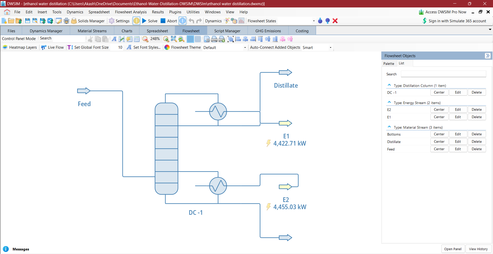

# Ethanol-Water Distillation Process Simulation & Energy Optimization

## Overview

A rigorous steady-state simulation of an ethanol-water distillation
column developed using DWSIM 9.0.5. Python scripting was used to
automate reflux-ratio sensitivity analysis and evaluate the trade-off
between ethanol separation performance and energy consumption.

## Project Objectives

- Develop a rigorous ethanol-water distillation model in DWSIM
- Apply the NRTL thermodynamic model
- Perform material and energy balance analysis
- Automate reflux-ratio sensitivity analysis using Python
- Evaluate ethanol purity, recovery and energy consumption
- Identify a practical operating point based on the separation-energy trade-off

## Process Flowsheet



## Simulation Specifications

| Parameter | Value |
|---|---:|
| Feed components | Ethanol + Water |
| Feed flow rate | 100 mol/s |
| Ethanol in feed | 50 mol% |
| Water in feed | 50 mol% |
| Feed temperature | 350 K |
| Feed pressure | 101.325 kPa |
| Thermodynamic model | NRTL |
| Number of stages | 20 |
| Feed stage | 10 |
| Condenser | Total condenser |
| Bottoms flow specification | 75 mol/s |
| Reflux ratio range | 1.5–3.5 |

## Methodology

A rigorous 20-stage distillation column was modeled in DWSIM.
The condenser was operated using a reflux-ratio specification,
while the bottoms product flow was fixed at 75 mol/s.

Five reflux ratios were investigated:

**1.5, 2.0, 2.5, 3.0 and 3.5**

For each case, the following quantities were obtained:

- Distillate flow rate
- Distillate ethanol concentration
- Bottoms flow rate
- Bottoms ethanol concentration
- Condenser duty
- Reboiler duty
- Ethanol recovery
- Total energy duty

### Ethanol Recovery

Ethanol recovery was calculated using:

Ethanol Recovery (%) =
(Distillate ethanol flow / Feed ethanol flow) × 100

## Python Automation

Python scripting within DWSIM was used to automate the sensitivity
analysis.

The script:

1. Sets the reflux-ratio specification
2. Solves the DWSIM flowsheet
3. Retrieves distillate and bottoms compositions
4. Retrieves condenser and reboiler duties
5. Calculates ethanol recovery
6. Stores the results
7. Repeats the procedure for all five reflux ratios

This reduced manual data collection and provided a consistent
calculation procedure across all operating cases.

## Results

| Reflux Ratio | Distillate EtOH (mol%) | Bottoms EtOH (mol%) | Total Duty (kW) | EtOH Recovery (%) |
|---:|---:|---:|---:|---:|
| 1.5 | 79.43 | 40.19 | 4959.86 | 39.72 |
| 2.0 | 80.69 | 39.77 | 5938.65 | 40.35 |
| 2.5 | 81.53 | 39.49 | 6917.91 | 40.77 |
| 3.0 | 82.11 | 39.29 | 7897.66 | 41.05 |
| 3.5 | 82.52 | 39.16 | 8877.73 | 41.26 |

## Sensitivity Analysis

### Energy Consumption


### Ethanol Recovery


### Distillate Ethanol Purity


## Discussion

Increasing the reflux ratio improved both distillate ethanol purity
and ethanol recovery. However, this improvement was accompanied by
a significant increase in condenser and reboiler energy requirements.

The results demonstrate diminishing returns at higher reflux ratios.
For example, increasing the reflux ratio from 3.0 to 3.5 produced
only a small improvement in ethanol recovery while requiring a
substantial increase in energy consumption.

Therefore, the highest reflux ratio does not necessarily represent
the most efficient operating condition.

## Selected Operating Point

A reflux ratio of **2.5** was selected as a practical operating point
within the investigated range.

At this condition:

- Distillate ethanol purity: **81.53 mol%**
- Ethanol recovery: **40.77%**
- Total energy duty: **approximately 6.92 MW**

This condition provides a practical balance between separation
performance and energy consumption within the investigated range.

## Project Structure

```text
DWSIM/
    ethanol_water_distillation.dwxmlz

Data/
    Ethanol_Water_Reflux_Sensitivity.csv

Excel/
    Ethanol_Water_Reflux_Sensitivity.xlsx

Scripts/
    reflux_sensitivity.py

Figures/
    flowsheet.png
    energy_vs_reflux.png
    recovery_vs_reflux.png
    purity_vs_reflux.png

Ethanol_Water_Distillation_Report.pdf